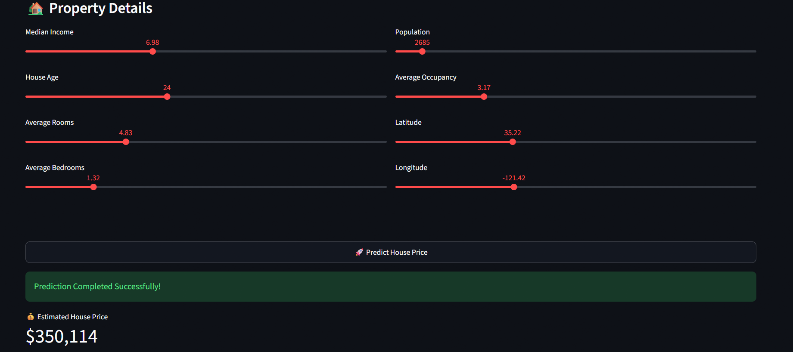

# 🏠 Housing Price Prediction using Machine Learning

> Predict California housing prices using Machine Learning and an interactive Streamlit dashboard.


---

# 📌 Project Overview

Housing prices depend on several factors such as income, house age, number of rooms, occupancy, and geographical location.

This project builds a Machine Learning regression model capable of predicting California housing prices based on property features.

The project also includes a clean Streamlit web application for real-time price prediction.

---

# 🚀 Demo

## Dashboard



---

## Prediction Result


---

# 📊 Dataset

**Dataset:** California Housing Dataset

Source:

Scikit-Learn

Number of Records:

20,640

Features:

- Median Income
- House Age
- Average Rooms
- Average Bedrooms
- Population
- Average Occupancy
- Latitude
- Longitude

Target:

Median House Value

---

# 🛠 Tech Stack

- Python
- Pandas
- NumPy
- Matplotlib
- Seaborn
- Scikit-Learn
- Joblib
- Streamlit

---

# 📂 Project Structure

```
Housing-Price-Prediction
│
├── assets
│   ├── dashboard.png
│   └── prediction.png
│
├── data
│   ├── raw
│   └── processed
│
├── models
│   └── best_model.pkl
│
├── outputs
│   └── figures
│
├── scripts
│   ├── preprocessing.py
│   ├── eda.py
│   ├── train_model.py
│   └── predict.py
│
├── app.py
├── requirements.txt
└── README.md
```

---

# 🔍 Exploratory Data Analysis

The project includes detailed EDA to better understand the housing dataset.

Visualizations include:

- Correlation Heatmap
- Feature Distributions
- Price Distribution
- Feature Relationships
- Missing Value Analysis

---

# 🤖 Machine Learning Models

The following regression models were trained and evaluated.

| Model | Purpose |
|--------|----------|
| Linear Regression | Baseline Model |
| Decision Tree Regressor | Non-linear Regression |
| Random Forest Regressor | Ensemble Learning |
| Gradient Boosting Regressor | Final Model |

---

## Train the Model

Before running the Streamlit app, train the model:

```bash
python scripts/train_model.py
```

This will generate:

```
models/best_model.pkl
```

# 📈 Model Performance

| Metric | Score |
|---------|------:|
| R² Score | 0.84 |
| MAE | 0.32 |
| RMSE | 0.46 |

> **Gradient Boosting Regressor** achieved the best overall performance and was selected as the final deployment model.

---

# 💻 Streamlit Application

The web application allows users to:

- Enter property information
- Predict housing prices instantly
- View model performance metrics
- Explore dataset preview

---

# 🚀 Installation

Clone the repository

```bash
git clone https://github.com/Rohittt619/Housing-Price-Prediction.git
```

Go inside project

```bash
cd Housing-Price-Prediction
```

Install dependencies

```bash
pip install -r requirements.txt
```

Run the application

```bash
streamlit run app.py
```

---

# 📌 Future Improvements

- Deploy on Streamlit Cloud
- Hyperparameter Optimization
- XGBoost & LightGBM Comparison
- SHAP Feature Importance
- House Price Trend Visualization
- REST API using FastAPI

---

# 👨‍💻 Author

## Rohit Rathod

Aspiring Data Analyst | Machine Learning Enthusiast

- GitHub: https://github.com/Rohittt619
- LinkedIn: https://linkedin.com/in/rohit-rathod-19442a228

---

⭐ If you found this project useful, don't forget to star the repository.